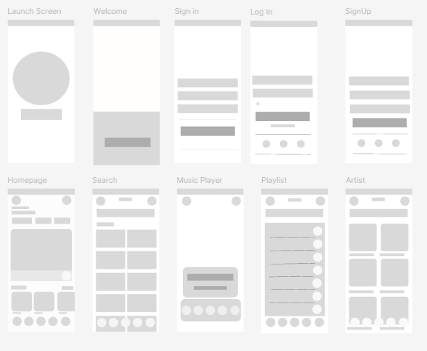
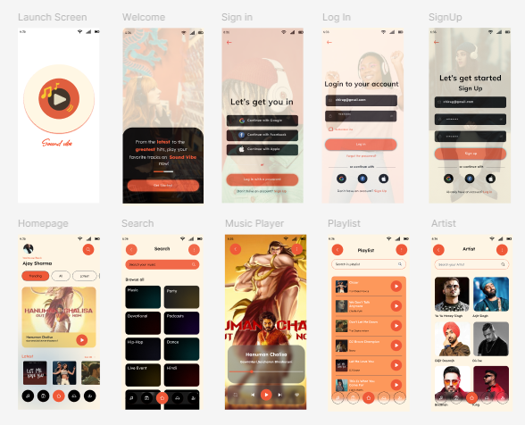

# 🎵 **Music Player App - Sound Vibe** 🎵

Welcome to the **Sound Vibe** project! This app is designed to provide seamless music streaming and playback functionality with an intuitive and user-friendly interface. 🎧✨

---

## 🗂 **Table of Contents**
1. [Project Overview](#project-overview)
2. [Features](#features)
3. [Wireframe & Design](#wireframe--design)
4. [Technologies Used](#technologies-used)
5. [Getting Started](#getting-started)

---

## 📋 **Project Overview**

The goal of the **Sound Vibe** project is to redefine the music streaming experience by offering:
- High-quality streaming 🎶
- Offline playback support 🚀
- Social sharing and playlist collaboration 🌐
- Aesthetic and responsive UI 🌟

This app is perfect for both casual listeners and music enthusiasts alike.

---

## 🌟 **Features**

✔️ Seamless music streaming with **zero buffering**  
✔️ **Customizable playlists** for every mood 🎼  
✔️ **Offline playback** for uninterrupted enjoyment 🛫  
✔️ Smart recommendations powered by user preferences 🤖  
✔️ Social integrations to share music with friends 🤝  

---

## 🎨 **Wireframe & Design**

### 🖍️ Wireframe  
 

---

### 🖌️ Final Design  

---

## 🛠 **Technologies Used**

- **Frontend:** Figma for design ⚛️  
  
---

## 🚀 **Getting Started**

- Explore the Figma wireframe and design links for an in-depth view of the user interface.

